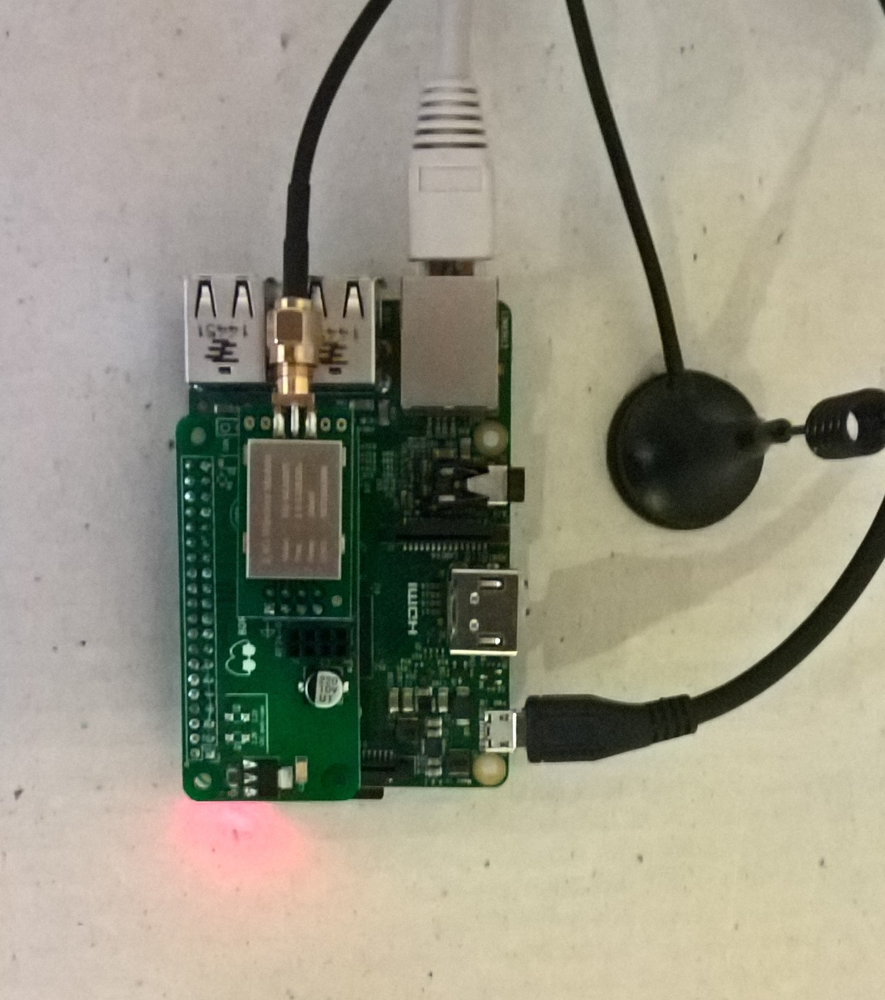
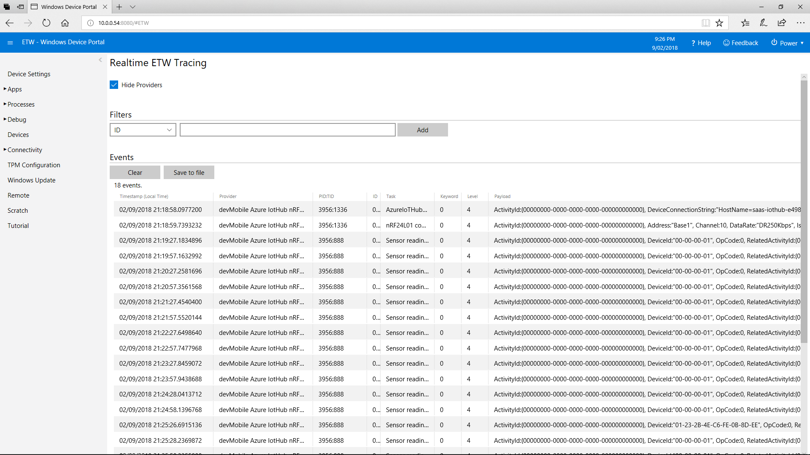
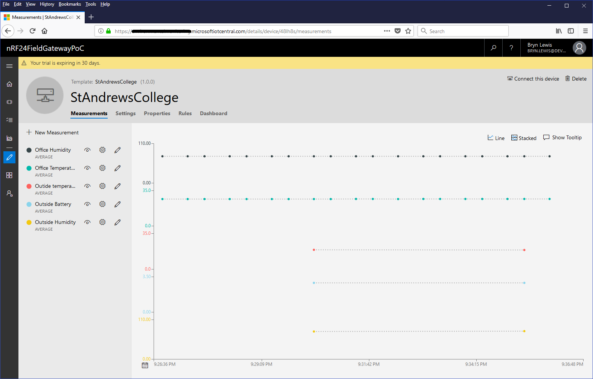

# Azure.IoTHub.IoTCore.FieldGateway.nRF24L01

A Windows 10 Iot Core based field gateway for uploading telemetry data from [nRF24L01](http://www.nordicsemi.com/eng/Products/2.4GHz-RF/nRF24L01) enabled devices to [Azure IoT Hub](https://azure.microsoft.com/en-us/services/iot-hub/) or [Microsoft IoT Central](https://www.microsoft.com/en-us/iot-central/)

I use an RPI nRF24L01 shield from [Ceech@Tindie](https://www.tindie.com/products/ceech/new-raspberry-pi-to-nrf24l01-shield) or Dual NRF24L01 pHat/Hat from [BorosLabs@Tindie](https://www.tindie.com/products/boros/borosrf2-dual-nrf24l01-phathat-rtc-for-pis/)

For use with Windows 10 IoT Core the Ceech Hat needs a simple modification detailed in my [blog](https://blog.devmobile.co.nz/2017/07/31/nrf24-windows-10-iot-core-hardware/)

The PI Hat is specified using a confitional compilation symbol defined in the project build properties. The supported options are
* CEECH_NRF24L01P_SHIELD
* BOROS_RF2_SHIELD_RADIO_0 
* BOROS_RF2_SHIELD_RADIO_1

The Boros RF2 shield has two nRF24L01 sockets, in a future release I will add support for both of them being active concurrently.

The Windows 10 IoT Core device logs useful information via Realtime ETW Tracing which can be viewed in the Device Portal Debug\ETW after 
enabling the "Microsoft-Windows-Diagnostics-LoggingChannel" provider.

The gateway has been tested on RP2/3 devices and has run for weeks without failure. 

Thanks to @techfooninja [RF24](https://github.com/techfooninja/Radios.RF24)

At the time of writing (Feb 2018) I was having an [issue](https://github.com/Azure/azure-iot-sdk-csharp/issues/310) with upgrading the Microsoft.Azure.Devices.Client NuGet package

I have sample Arduino, Seeeduino, Netduino, devDuino client projects and deployment packages under development

It looks like Microsoft IOT Central Measurement Field Names are case sensitive

I use Visual Studio 2017 to deploy the application (it is a background task) to my devices.

There is a sample json configuration file in the root folder. 

The AzureIoTHubDeviceConnectionString needs to be updated then the file uploaded to

User Folders\LocalAppData\Azure.IoTHub.IoTCore.FieldGateway.NRF24L01-uwp_1.0.0.0_arm__nmn3tag1rpsaw\LocalState\

I use the device portal "Apps\File Explorer"

There are more detailed instructions and sample projects on Hackster.IO
* Sample clients
  * [Arduino](https://github.com/KiwiBryn/FieldGateway.nRF24L01.DuinoClient)
  * [devDuino](https://github.com/KiwiBryn/FieldGateway.nRF24L01.devDuinoV2.2Client) 
  * [Netduino](https://github.com/KiwiBryn/FieldGateway.nRF24L01.NetduinoClient)
* [Azure IoT Hub project](https://www.hackster.io/KiwiBryn/azure-iot-hub-nrf24l01-windows-10-iot-core-field-gateway-b70917)

